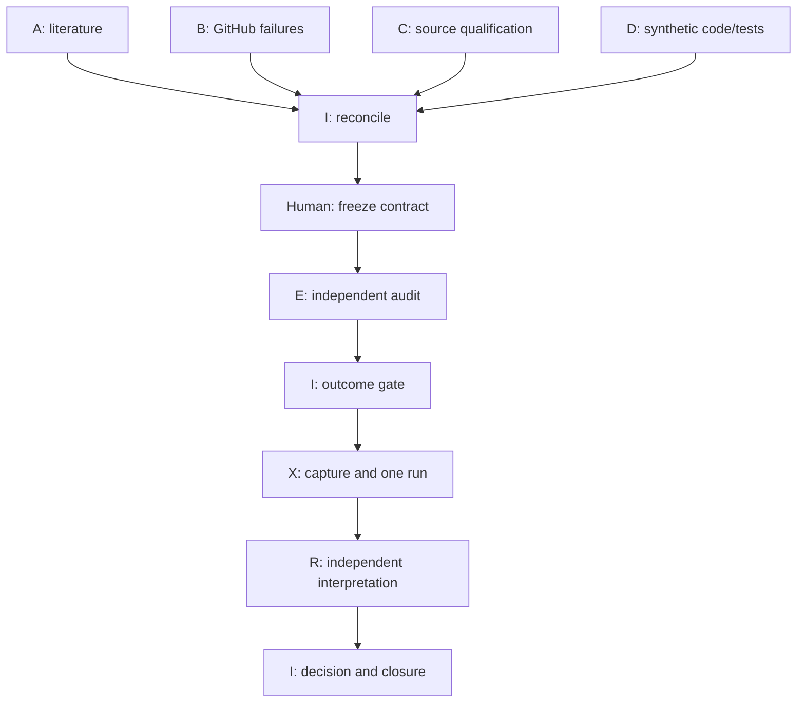

# Work plan / dispatch instructions

全pathは `research/lines/currency-strength-momentum-v0.1/` 相対。市場outcome gateはCLOSED。A–Dは同じdesign snapshotから並列実行できる。今は調査・合成実装のPacketを渡し、Xを起動しない。

## Packet一覧とwrite ownership

| Worker | Packet | Responsibility | Exclusive write path | Reads actual-market outcome |
|---|---|---|---|---|
| A | [PACKET_A_LITERATURE](packets/PACKET_A_LITERATURE.md) | 原論文、recent reassessment、factor/mechanism、G10転用範囲 | work/literature/** | No（公刊第三者結果のみ可） |
| B | [PACKET_B_GITHUB_PRIOR_ART](packets/PACKET_B_GITHUB_PRIOR_ART.md) | 複数repo code/tests/history、negative、cost/leakage/live divergence | work/github-prior-art/** | No（第三者既存記録のみ可） |
| C | [PACKET_C_SOURCE_QUALIFICATION](packets/PACKET_C_SOURCE_QUALIFICATION.md) | metadata/API/time/calendar/status/legal、source lock | work/source-qualification/** | No（値を遮断した固定probeのみ） |
| D | [PACKET_D_IMPLEMENTATION](packets/PACKET_D_IMPLEMENTATION.md) | synthetic transformation/metrics/temporal/gate tests、frozen code候補 | work/implementation/** | No（syntheticのみ） |
| I | [PACKET_I_INTEGRATOR](packets/PACKET_I_INTEGRATOR.md) | reconciliation、human freeze、gate、最後のDecision | work/integration/** と指定canonical records | freeze前No、closure後既存Resultのみ |
| E | [PACKET_E_INDEPENDENT_AUDIT](packets/PACKET_E_INDEPENDENT_AUDIT.md) | Dとは独立contextでfrozen contract/codeの監査 | work/independent-audit/** | No |
| X | [PACKET_X_EMPIRICAL_EXECUTION](packets/PACKET_X_EMPIRICAL_EXECUTION.md) | gate後、一回のfixed market runとreceipt | runs/results/artifacts/snapshotの指定path | Yes、fixed role/期間/metricsのみ |
| R | [PACKET_R_POST_RESULT_REVIEW](packets/PACKET_R_POST_RESULT_REVIEW.md) | Xと別session、bounded Interpretation、次行動 | interpretations/**、work/post-result-review/** | Xの既存ledger/metricsのみ |

4つのLuna Max WORK（A–D）を並列。その後EのLuna Max WORKを使う（初期draft auditはできるがfinal PASSはfrozen inputsに対して）。I/RはSolまたは独立review sessionを推奨。Xは別Luna Max WORK。これは一度に8agentsを常設する設計ではない。

## Sequential dependencies

Dのpure functionsはCを待たず実装。source adapter/metadata integrationはC lockをfresh readした後にDが追加し、その最終commitをEが監査する。CやEがDのpathを直接変更しない。I1でcontradictionを発見したら、担当workerが専用pathを修正しexact headsを更新。E/I final gateは変更前のhashから継承しない。

**並列可能:** literature/public scientific outcomes、public GitHub履歴、source metadata/合法性、mathematical proof、synthetic implementation/tests、draft review。経済screen/factor分析のoutcome-blind仕様準備も後で並列可能。

**直列必須:** human科学契約確定 → code/source/config/role freeze → 最終独立監査 → I gate → actual dataset capture/identity preflight → event ledger freeze → market outcome一回 → Result保存 → 独立解釈 → 次の研究判断。unused confirmationのdesign/指定/初回accessも単一管理下。異なるworkerが同じholdoutを開かない。

parallel研究者にfinal scientific decision rightsを分散しない。Iもhumanの未確定条件を選べない。research workflowのstateとResultのexecution/evidence/scientific dimensionsを分ける。

## 各WORKへそのまま渡す指示

次の文章の `<LETTER>`、`<PACKET_PATH>`、`<ARCHITECTURE_HEAD_SHA>` を置換する。

> Josh-Temple/systematic-trading-research のmainをfresh readしてください。architecture planの指定commit `<ARCHITECTURE_HEAD_SHA>` とmainを区別し、`<PACKET_PATH>` を全文読んで、そのPacketの全scopeを実行してください。RoleはLuna Max `<LETTER>` です。canonical scientific conditionsを変更せず、自分のallowlist pathだけ専用branchへ保存してください。一件で止まらず全項目を処理し、個別gapは記録して独立項目を継続してください。市場outcomeアクセスは禁止です。remote全文readback/差分/hash確認後にhead SHA、PR URL、完了matrixを報告してください。

A/B/C/Dへ渡すのは各Packetだけで開始できる（required readsはPacket内）。E/I/X/Rへ上の「市場outcome禁止」文を機械的にコピーせず、該当Packetのstage-specific permissionを使う。Xは**別の明示的指示**とgate PASSがあるまで起動しない。

## Git/base/ref rule

architecture PRが未統合ならWorker branchはそのexact headをbaseにし、そのarchitecture branchをPR baseにする。計画文書はproposal_ref、mainはmain_shaとして記録。統合後はfresh mainをbaseにする。headをsnapshot pinし、worker中にmoving mainの科学条件を勝手に取り込まない。

A–Dは共通ファイルを編集しない。独立成果をIが順序merge/collectし、同じpathの衝突はIに集約。scienceの変更が必要なら新versionとhuman receiptを先に作る。provisional branchをmergeしない。

## Two-stage outcome gate

**Gate1 / I:** human-approved frozen science + qualified source route/schema/calendar + code/config/environment identity + synthetic tests + independent E audit + fixed dataset role/access owner/baseline/rule/no-search + durable save pathがPASS。

**Gate2 / X preflight:** actual bytesをcapture、7series/unit/status/range/duplicate/finite/calendarをvalidate、raw/source/config/code-at-use hashesを保存/readback、event ledger hashをpersist。new science mismatchならSTOP。Gate2は科学条件を選び直す権限ではなくfrozen source/codeとの機械的一致を検査する。

Gate1だけでは価格returnを計算不可、Gate2だけでもhuman科学契約を置き換えられない。両方をreceiptにbindして初めてXが一回実行する。

## Current dispatch readiness

- A/B: READY_FOR_PREPARATION（full review残務あり）。
- C: READY_FOR_QUALIFICATION（API/docsとhistorical clock/calendar未qualification）。
- D: READY_FOR_SYNTHETIC_IMPLEMENTATION（scientific案は実装可能、future freeze確認要）。
- I1: A–D成果待ち。human契約の具体提案は既に保存済み。
- E final/I2: human/code/source final identities待ち。
- X/R/I3: NOT_AUTHORIZED_YET / dependency待ち。

このreadiness表はcoordinationであり市場の支持/不支持ではない。
